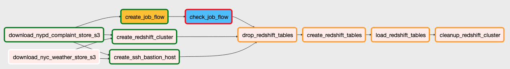
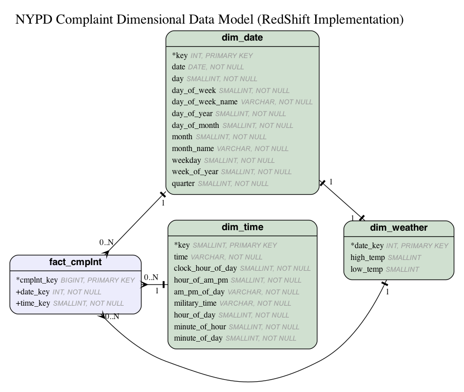

# NYPD Complaint Analysis

An analysis of New York City Police Department (NYPD) complaints.


## Design

### ETL

Data is extracted from [New York City open data portal](https://data.cityofnewyork.us/Public-Safety/NYPD-Complaint-Data-Historic/qgea-i56i). Data is also extracted from this GitHub repository for historical NYC NOAA weather data. Unfortunately it's a manual process to download data from NOAA currently but hopefully in the future they're be a RESTful API built to extract this data.

Once the data files are downloaded to S3, data is transformed within Amazon Elastic Map Reduce (EMR). The transformed data is stored back to Amazon S3 as CSV files. An improvement in the future would to store the transformed data files in Apache Parquet format.

Finally, the transformed data files are loaded into a final dimensional model in Amazon Redshift. Analysis can be performed on this dimensional model with quick query response times. You can utilize client tools such as Tableau or psql to conduct analysis on the final data set.

The following is a screenshot of the Airflow DAG implemented in this repo:



Note the parallelism of the DAG. Data is downloaded in parallel. The EMR and Redshift clusters are created in parallel. This is to decrease the amount of time of the overall DAG run. Be sure to have enough Airflow workers in your environment to benefit from this parallelism.

### Data Model

A snowflake dimensional model is utilized for OLAP-based analysis. The design reduces end-user data model complexity and the amount of joins required when querying the data. Additional datasets could be added in the future to enable further analysis of the complaint data. A great set of data to add to this would be U.S. Census data.

The following is the current dimensional model:



The model can be queried to determine if complaints increase or decrease based on low or high temperatures for NYC. For example:

```SQL
SELECT dim_weather.high_temp,
       COUNT(cmplnt_key) AS cnt
FROM fact_cmplnt 
JOIN dim_weather
ON fact_cmplnt.date_key = dim_weather.date_key
GROUP BY dim_weather.high_temp
ORDER BY cnt DESC;
```

Or the model could be queried the hour of the day to see if complaints increase / decrease based on time of day:

```SQL
SELECT dim_time.military_time,
       AVG(cmplnt_key) AS avg
FROM fact_cmplnt 
JOIN dim_time
ON fact_cmplnt.time_key = dim_time.key
GROUP BY dim_time.military_time
ORDER BY avg DESC;
```

#### Data Dictionary

| table       | column | data type | description |
| ----------  | ------ | ----------- | ------- |
| dim_weather | date_key | INT, PRIMARY KEY | Common key utilizing YYYYMMDD to reduce need to look up this surrogate key in dim_date |
| dim_weather  | high_temp | SMALLINT | Highest temperature reached on this day for NYC |
| dim_weather  | low_temp | SMALLINT | Lowest temperature reached on this day for NYC |
| dim_time | key | SMALLINT | Key created by HHmm |
| dim_time | time | VARCHAR | Time in 'HH:mm AM/PM" format |
| dim_time | clock_hour_of_day | SMALLINT | Clock hour of day |
| dim_time | hour_of_am_pm | SMALLINT | Values 1-12 |
| dim_time | military_time | VARCHAR | Format: "HH:mm" i.e. 23:01 |
| dim_time | hour_of_day | SMALLINT | 0-23 |
| dim_time | minute_of_hour | SMALLINT | 0-59 |
| dim_time | minute_of_day | SMALLINT | 0-1439 |
| dim_date | key | INT PRIMARY KEY | Key in format YYYYMMDD |
| dim_date | date | DATE | Date in format YYYY-MM-dd  |
| dim_date | day | SMALLINT | Day of month |
| dim_date | day_of_week | SMALLINT  | Day of week |
| dim_date | day_of_week_name | VARCHAR  | Day of week name |
| dim_date | day_of_year | SMALLINT  | Day of year |
| dim_date | day_of_month | SMALLINT  | Day of month |
| dim_date | month | SMALLINT  | Month number |
| dim_date | month_name | VARCHAR  | Month name |
| dim_date | weekday | SMALLINT  | Weekday (1-7)|
| dim_date | week_of_year | SMALLINT  | Week of year |
| dim_date | quarter | SMALLINT  | Calendar quarter |
| fact_cmplnt | cmplnt_key | BIGINT | Complaint identifier from original data source |
| fact_cmplnt | date_key | INT | Common key utilizing YYYYMMDD to reduce need to look up this surrogate key in dim_date |
| fact_cmplnt | time_key | SMALLINT | Common key utilizing HHmm to reduce need to look up this surrogate key in dim_time |

## Future Considerations

In the future, it would be great to integrate additional police department complaint data into the dataset. If the data were to increase even by 100x this solution would be easy to scale by just adding additional nodes to both the AWS EMR and RedShift clusters.

Also, it would be great to get the NYPD complaint data for the previous day and load it into the dataset for recent analysis. Airflow could be schedule to run the import at perhaps 7AM everyday to import the previous day's complaint data.

Scaling is no problem with this solution. If you need 100+ people to query the dataset just expand the number of nodes on your AWS RedShift cluster. Currently the node count is hardcoded into this solution but that could easily be parameterized and passed in via the Makefile.

## Installation

Clone this repository:

`git clone https://github.com/rigganni/NYPD-Complaint-Analysis.git`

Install Apache Airflow. The following is a docker-compose snippet to assist in setting up:

```docker
postgres-airflow:
    image: postgres:9.6
    container_name: postgres-airflow
    environment:
      - POSTGRES_USER=<your-airflow-db-user>
      - POSTGRES_PASSWORD=<your-airflow-db-password>
      - POSTGRES_DB=airflow
      - PUID=${PUID}
      - PGID=${PGID}
      - TZ=${TZ}
    volumes:
      - <your-docker-directory>/airflow-postgres:/var/lib/postgresql/data
    logging:
      options:
        max-size: 10m
        max-file: "3"
    networks:
      - <your-docker-network>
    dns:
      - 1.1.1.1
  webserver-airflow:
    image: puckel/docker-airflow:1.10.7
    container_name: webserver-airflow
    restart: unless-stopped
    depends_on:
      - postgres-airflow
    environment:
      - LOAD_EX=y
      - EXECUTOR=Local
      - PUID=${PUID}
      - PGID=${PGID}
      - TZ=${TZ}
      - "FERNET_KEY=<your-airflow-fernet-key>"
      - POSTGRES_HOST=postgres-airflow
      - POSTGRES_USER=<your-airflow-db-user>
      - POSTGRES_PASSWORD=<your-airflow-db-password>
      - POSTGRES_DB=airflow
      - AIRFLOW__WEBSERVER__AUTHENTICATE=True
      - AIRFLOW__WEBSERVER__AUTH_BACKEND=airflow.contrib.auth.backends.password_auth
      - AIRFLOW__CORE__SQL_ALCHEMY_CONN=postgresql://<your-airflow-db-user>:<your-airflow-db-password>@postgres-airflow/airflow
      - AIRFLOW__SCHEDULER__MIN_FILE_PROCESS_INTERVAL=0
      - AIRFLOW__SCHEDULER__DAG_DIR_LIST_INTERVAL=60
    logging:
      options:
        max-size: 10m
        max-file: "3"
    volumes:
      - <your-docker-directory>/airflow-webserver/dags:/usr/local/airflow/dags
      - <your-docker-directory>/airflow-webserver/plugins:/usr/local/airflow/plugins
      - <your-docker-direcotry>/airflow-webserver/requirements.txt:/requirements.txt
    command: webserver
    healthcheck:
      test: ["CMD-SHELL", "[ -f /usr/local/airflow/airflow-webserver.pid ]"]
      interval: 30s
 timeout: 30s
      retries: 3
    networks:
      - <your-docker-network>
    dns:
      - 1.1.1.1
    labels:
      - "traefik.enable=true"
      - "traefik.backend=webserver-airflow"
      - "traefik.frontend.rule=Host:airflow.${DOMAINNAME}"
      - "traefik.port=8080"
      - "traefik.docker.network=<your-docker-network>"
      - "traefik.frontend.headers.SSLRedirect=true"
      - "traefik.frontend.headers.STSSeconds=315360000"
      - "traefik.frontend.headers.browserXSSFilter=true"
      - "traefik.frontend.headers.contentTypeNosniff=true"
      - "traefik.frontend.headers.forceSTSHeader=true"
      - "traefik.frontend.headers.SSLHost=<your-SSL-host>"
      - "traefik.frontend.headers.STSIncludeSubdomains=true"
      - "traefik.frontend.headers.STSPreload=true"
      - "traefik.frontend.headers.frameDeny=false"
```

Install [Apache Spark](https://spark.apache.org/) and [Minio](https://min.io/) if running locally. 

Example Spark bash docker start script:

```bash
docker pull docker.io/bitnami/spark:latest

# Stop running spark containers if already running
if (docker ps | grep -ic spark > /dev/null 2>&1 ); then
  echo "Spark container currently running. Stopping container."
  docker stop spark;
  docker stop spark-worker-1
  docker stop spark-worker-2
  sleep 20
fi

docker run  \
    -td \
    --rm \
    --network="<your-docker-network>" \
    --name "spark" \
    --label-file <your-traefik-label-file> \
    -e SPARK_MODE="master" \
    -e SPARK_RPC_AUTHENTICATION_ENABLED="no" \
    -e SPARK_RPC_ENCRYPTION_ENABLED="no" \
    -e SPARK_LOCAL_STORAGE_ENCRYPTION_ENABLED="no" \
    -e SPARK_SSL_ENABLED="no" \
    -e MINIO_ACCESS_KEY=<your-minio-access-key> \
    -e MINIO_SECRET_KEY=<your-mino-secrety-key> \
    docker.io/bitnami/spark:latest

docker run  \
    -td \
    --rm \
    --network="<your-docker-network>" \
    --name "spark-worker-1" \
    -e SPARK_MODE="worker" \
    -e SPARK_MASTER_URL="spark://spark:7077" \
    -e SPARK_WORKER_MEMORY="1G" \
    -e SPARK_WORKER_CORES=1 \
    -e SPARK_RPC_AUTHENTICATION_ENABLED="no" \
    -e SPARK_RPC_ENCRYPTION_ENABLED="no" \
    -e SPARK_LOCAL_STORAGE_ENCRYPTION_ENABLED="no" \
    -e SPARK_SSL_ENABLED="no" \
    docker.io/bitnami/spark:latest

docker run  \
    -td \
    --rm \
    --network="<your-docker-network>" \
    --name "spark-worker-2" \
    -e SPARK_MODE="worker" \
    -e SPARK_MASTER_URL="spark://spark:7077" \
    -e SPARK_WORKER_MEMORY="1G" \
    -e SPARK_WORKER_CORES=1 \
    -e SPARK_RPC_AUTHENTICATION_ENABLED="no" \
    -e SPARK_RPC_ENCRYPTION_ENABLED="no" \
    -e SPARK_LOCAL_STORAGE_ENCRYPTION_ENABLED="no" \
    -e SPARK_SSL_ENABLED="no" \
    docker.io/bitnami/spark:latest

# Packages required for NYPD complaint analysis
docker exec -it -u root spark sh -c "python -m pip install wheel pyspark pandas boto3"
```

Example Minio docker-compose snippet:

```docker
minio-1:
    image: minio/minio
    container_name: minio-1
    restart: unless-stopped
    volumes:
      - <your-docker-dir>/minio1/data:/data
      - <your-docker-dir>/minio1/config:/root/.minio
      - >your-docker-dir>/minio1/export:/export
    networks:
      - <your-docker-network>
    ports:
      - 9000:9000
    dns:
      - 1.1.1.1
    environment:
      - TZ=${TZ}
      - PUID=${PUID}
      - PGID=${PGID}
      - MINIO_ACCESS_KEY=<your-minio-access-key>
      - MINIO_SECRET_KEY=<your-minio-secret-key>
    command: server /data
```

Note: utilize a reverse proxy such as [Traefik](https://docs.traefik.io/) for secure access in your environment.

Set the following environment variables based on your environment:

| environment variable | 
| -------------------- |
| SPARK_LOCAL_MASTER_DOCKER_ID |
| AIRFLOW_DOCKER_ID |
| AIRFLOW_DAG_ROOT_FOLDER |
| AWS_EMR_LOG_BUCKET |
| AWS_S3_S3FS_PASSWORD_FILE |

If executing within a terminal session (i.e. Bash, Zsh), utilize the the `export` command. If within Python, utilize `import os; os.environ["your-variable"]`.

AWS EMR & Redshift clusters are created via the `boto3` python module. See the Makefile & python source code to see how that is done.

Execute `make requirements` to install required conda environment.

## Usage

Data model loading and analysis can be performed by the following make commands:

| make Command | Description |
| ------------ | ----------- |
| airflow_clear_runs | Clear all airflow runs |
| airflow_deploy |     Deploy airflow file |
| airflow_get_configs |Download configparser files from AirFlow to local environment |
| airflow_trigger_dag_aws_delete_redshift |Execute airflow on AWS and delete RedShift cluster |
| airflow_trigger_dag_aws_keep_redshift |Execute airflow on AWS and keep RedShift cluster |
| airflow_trigger_dag_local |Execute airflow on local dev environment |
| clean |              Delete all compiled Python files |
| cleanup_aws |        Remove bastion host & RedShift cluster |
| connect_psql_redshift |Connect to nypd_complaint via psql |
| lint |               Lint all python files |
| load_data_to_redshift |Load data from S3 to RedShift |
| mount_aws_emr_log_directory |Mount AWS EMR logs via s3fs to local directory |
| requirements |       Install Python Dependencies |
| run_local_transform |Run local Spark transforms |
| spark_analysis_aws | Open interactive prompt for Spark ad hoc analysis on AWS EMR cluster |
| spark_analysis_local |Open interactive prompt for Spark ad hoc analysis on local Spark docker container |
| ssh_aws_emr_master | Connect to master node of running AWS EMR cluster |
| test_dimenional_model_datasets |Test transform_data.py on existing EMR instance on AWS |
| test_redshift_aws_creation |Test creating of RedShift cluster |
| test_transform_aws | Test transform_data.py on existing EMR instance on AWS |

#### Sources

* NYPD Complaint Data
  * https://data.cityofnewyork.us/Public-Safety/NYPD-Complaint-Data-Historic/qgea-i56i
* Great article on creating reproducible data science datasets
  * Inspiration for utilizing Makefile
  * https://medium.com/@davidstevens_16424/make-my-day-ta-science-easier-e16bc50e719c

#### Future Improvements

* Execute Spark code from Airflow
  * Local Airflow service is running in a container. Currently limited by not being to able to call Docker container from another within another container. Could create an API (i.e. gunicorn & flask) or just a hook to call `make run_transform_local`.
* Create Ansible playbook to install & setup all dependencies
  * Install local Airflow, Spark, Minio instances
* Create dynamic AirFlow tasks to reduce code footprint
  * For each download or load of data files, dynamically create tasks on the fly instead of hardcoding in DAG

#### Development Steps

* Analyzed raw CSV files utilizing local Spark cluster and it's ability of schema on read
* Identified columns for first release to use of analysis
* Created extract code
* Created transform code
* Created load code
* Performed ad hoc analysis
